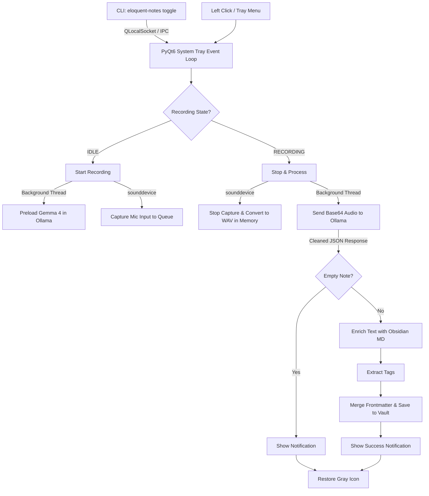

# Eloquent Notes for Linux

Eloquent Notes is a lightweight, system-tray-centric utility for Linux inspired by [Google Eloquent](https://developers.google.com/edge/eloquent) that runs silently in the background. It allows you to record quick dictations, automatically cleans them, enriches them with Obsidian Markdown features, extracts relevant tags using a multi-step local **Gemma 4** model pipeline (via Ollama), and writes the resulting notes directly to your Obsidian vault.

---

## ✨ Features

- **System Tray Centric UX:** Control recording easily by clicking the system tray icon (click to start, click again to stop and process).
- **Context Menu Actions:** Right-click the system tray icon to reveal a menu with options to:
  - **Start/Stop Recording**
  - **Reload Configuration** (reloads settings and prompts on-the-fly without restarting the application)
  - **Quit**
- **CLI & Daemon Decoupling:** The CLI command (`eloquent-notes toggle`) is lightweight and decoupled from the heavy graphical interface (PyQt6). It uses a local Unix socket to immediately signal the running daemon to toggle recording.
- **Offline & Private:** Transcribes and refines audio locally on your machine using Gemma 4 via Ollama.
- **Dynamic Icons:** Status indicators are rendered dynamically in memory:
  - 🔘 **Idle (Gray):** A gray circle with a white microphone icon.
  - 🔴 **Recording (Red):** A red circle with a white recording dot.
  - 🟠 **Processing (Orange):** An orange circle with a white hourglass.
- **Advanced Obsidian Integration:**
  - Automatically enriches your spoken notes with Obsidian callouts (`> [!info]`) and wikilinks (`[[topics]]`).
  - Automatically analyzes dictations to generate relevant tags.
  - Appends notes to daily journals or creates new individual files inside your vault.
  - Intelligently parses, merges, and updates YAML frontmatter metadata when appending to existing notes without breaking formatting.
- **Customizable Multi-Step Prompts:** Edit custom Markdown prompts for every stage of the pipeline (Cleaning, Enriching, Tag Extraction) loaded directly from your user config directory.
- **Custom Note Templates:** You can customize the Markdown formatting of the generated notes, including dynamic `{tags}` injection.

---

## 📋 Prerequisites

1. **Ollama & Gemma 4 Model:**
   Ensure you have Ollama running locally and have pulled a Gemma 4 model (the default model configured is `gemma4:12b-it-qat`):
   ```bash
   ollama pull gemma4:12b-it-qat
   ```

2. **System Dependencies:**
   Install PortAudio (required for audio capture and beep playback) and a notification server (PyQt6 uses DBus/System notification services to display desktop alerts):
   ```bash
   # On Ubuntu/Debian/Pop!_OS:
   sudo apt install libportaudio2
   ```

---

## 🚀 Installation

### Option A: Install using `pipx` or `uv` (Recommended)
You can install the utility directly from GitHub:
```bash
# Using uv
uv tool install git+https://github.com/arrase/eloquent-notes.git

# Or using pipx
pipx install git+https://github.com/arrase/eloquent-notes.git
```

### Option B: Local Installation (For Development)
If you want to modify the source code or run in development mode:
```bash
# Clone the repository and navigate inside
git clone https://github.com/arrase/eloquent-notes.git
cd eloquent-notes

# Create virtual environment and install in editable mode
python3 -m venv .venv
source .venv/bin/activate
pip install -e .
```

---

## ⚙️ Configuration

Upon the first execution, Eloquent Notes will automatically initialize a configuration directory at `~/.config/eloquent-notes/`.

### 1. `config.yaml`
Edit `~/.config/eloquent-notes/config.yaml` to specify your Obsidian vault path and adjust system parameters. Below is the default configuration:

```yaml
obsidian:
  vault_path: "~/Obsidian"     # Absolute or user-relative path to your Obsidian Vault
  folder: "Dictations"         # Target folder inside the vault where notes will be saved
  daily_notes: true            # If true, appends dictations to daily note files (YYYY-MM-DD.md)

ai:
  ollama_url: "http://localhost:11434"
  model: "gemma4:12b-it-qat"
  context_length: 10000        # Context length limit (null defaults to model maximum)
  keep_alive: "0"              # Time to keep model loaded in VRAM after note generation (e.g. "5m", "10m", or "0" to unload immediately)
  preload_keep_alive: "5m"     # Time to keep model weights loaded in VRAM during recording to minimize note generation cold-start
  max_retries: 3               # Number of times to retry LLM execution if the output is not valid JSON
  preload_timeout: 180         # Timeout in seconds for preloading the model weights
  request_timeout: 300         # Timeout in seconds for note generation requests

audio:
  sample_rate: 16000           # Audio sample rate (16kHz is ideal for Gemma 4)
  channels: 1                  # Mono channel recording
  beep_frequency: 440          # Audio cue beep frequency (Hz)
  beep_duration: 0.1           # Beep duration (seconds)
  beep_enabled: true           # Enable/disable audio cues (beeps)

logging:
  level: "INFO"                # Logger verbosity level (DEBUG, INFO, WARNING, ERROR, CRITICAL)
```

### 2. Custom Prompts
The application relies on a multi-step pipeline to guarantee high-quality generation from smaller local models. You can edit the system, user, and retry prompts for each step in `~/.config/eloquent-notes/prompts/`:

**Step 1: Audio Transcription & Cleaning**
- `system_prompt.md`: Instructs the model on how to format, structure, and clean filler words.
- `user_prompt.md`: Sends execution context for the specific audio file.

**Step 2: Obsidian Markdown Enrichment**
- `obsidian_enrich_system_prompt.md`: Instructs the model to add Callouts, Wikilinks, etc.
- `obsidian_enrich_user_prompt.md`: Context for the enrichment step.

**Step 3: Tag Extraction**
- `obsidian_tags_system_prompt.md`: Rules for identifying and formatting document tags.
- `obsidian_tags_user_prompt.md`: Context for tag extraction.

**Error Recovery**
- `retry_prompt.md`: Universal prompt to correct the model's output if it fails to generate valid JSON across any of the steps.

### 3. Custom Note Templates
You can customize the Markdown formatting of the generated notes, including frontmatter and headers. Eloquent Notes provides three template files in `~/.config/eloquent-notes/templates/`:
- **`standalone.md`:** Used when `daily_notes: false` (creates an individual file per dictation).
- **`daily_new.md`:** Used when `daily_notes: true` and a new daily note is being created.
- **`daily_append.md`:** Used when `daily_notes: true` and the daily note already exists (useful for skipping frontmatter on subsequent entries).

You can use the following placeholders in these templates, which will be automatically replaced when saving the note:
- `{text}`: The cleaned and Obsidian-enriched text generated by the AI model.
- `{tags}`: A YAML-formatted string array of tags extracted by the AI model.
- `{date}`: The current date (e.g., `2026-07-04`).
- `{time}`: The current time (e.g., `00:45:45`).

---

## 🎮 Usage

### 🔄 1. Setup Autostart on Boot
To ensure Eloquent Notes runs in the background automatically when you log in (allowing keyboard shortcuts to work instantly), execute:
```bash
eloquent-notes install-autostart
```
This generates a desktop autostart entry at `~/.config/autostart/eloquent-notes.desktop`.

*If you want to start the background service manually for the first time without logging out, run:*
```bash
eloquent-notes &
```

### ⌨️ 2. Global Keyboard Shortcut (Recommended)
Instead of clicking the system tray icon, you can toggle recording from anywhere (even inside fullscreen apps) using a global keyboard shortcut. Eloquent Notes exposes a toggle command:
```bash
eloquent-notes toggle
```
*(You can also use the shorthand: `eloquent-notes -t` or `eloquent-notes --toggle`)*

To bind this to a keyboard shortcut in your Linux desktop environment:

#### GNOME (Ubuntu, Debian, Pop!_OS, Fedora)
1. Go to **Settings** -> **Keyboard** -> **Keyboard Shortcuts** -> **View and Customise Shortcuts**.
2. Scroll to the bottom and select **Custom Shortcuts**.
3. Click the **+** button (or **Add Shortcut**) and enter:
   - **Name:** `Eloquent Notes Toggle`
   - **Command:** `eloquent-notes toggle`
   - **Shortcut:** Press your preferred keys (e.g., `Ctrl+Alt+N`)
4. Click **Add**.

#### KDE Plasma
1. Go to **System Settings** -> **Shortcuts** -> **Custom Shortcuts**.
2. Select **Edit** -> **New** -> **Global Shortcut** -> **Command/URL**.
3. Name it `Eloquent Notes Toggle`.
4. In the **Trigger** tab, record your shortcut.
5. In the **Action** tab, set the command to `eloquent-notes toggle`.
6. Click **Apply**.

#### i3 / Sway
Add the following keybinding to your config file (usually `~/.config/i3/config` or `~/.config/sway/config`):
```text
bindsym $mod+Ctrl+n exec --no-startup-id eloquent-notes toggle
```

### 🔘 3. Interaction Flow
1. **Idle State:** The gray microphone icon is shown in the system tray.
2. **Start Dictation:** Click the tray icon, trigger your custom global shortcut, or run `eloquent-notes toggle`. A beep plays, and the icon turns **red** to indicate it is recording.
   * *Note: The model starts preloading into VRAM in the background during recording to speed up processing.*
3. **Stop & Process:** Click the tray icon, trigger the shortcut, or run `eloquent-notes toggle` again. A beep plays, the icon turns **orange**, and the application starts processing the audio via the local Ollama API.
4. **Completion:**
   * **Success:** The cleaned transcription is saved to your Obsidian vault, a desktop notification is displayed, and the icon returns to **gray**.
   * **Empty Audio:** If the audio contains only silence or background noise, a "Dictation Empty" notification is displayed, and no note is created. The icon returns to **gray**.

---

## 🏗️ Architectural Overview

Eloquent Notes is built with a highly responsive, asynchronous, and memory-efficient architecture:



### Key Technical Details
* **CLI & GUI Decoupling:** The entry point (`eloquent-notes`) only loads PyQt's lightweight core components (`QCoreApplication` and `QLocalSocket`) when communicating with the running instance. If the daemon is already running, it sends an IPC command and exits immediately, avoiding loading any windows or graphical elements. If it is not running, it replaces the current process with the daemon (`eloquent_notes.app`) via `os.execv`.
* **In-Memory Audio Processing:** Audio is captured directly from your microphone using `sounddevice` and loaded into an in-memory queue. When recording stops, it is processed into 16-bit PCM WAV bytes in-memory (using `io.BytesIO`). No temporary audio files are written to the disk, maximizing privacy, speed, and disk lifespan.
* **Non-Blocking UI Threads:** Both the model preloading and the Ollama API request processing are offloaded to background threads. This ensures that the PyQt6 system tray UI loop remains entirely responsive without stuttering or freezing.
* **Dynamic Icon Generation:** Custom state icons are drawn dynamically in-memory using Pillow (`PIL`) and converted to `QIcon` objects at runtime. No external image assets are required.
* **Structured Model Output & Robust Parsing:** The transcription request is sent to Ollama's `/api/chat` using structured JSON schema format instructions. The response is robustly parsed by finding the first `{` and the last `}` to isolate the JSON, ensuring compatibility even if the model outputs conversational preamble or postscript.
* **Structured Logging (XDG Compliant):** Logs are stored in accordance with the XDG Base Directory specification at `~/.local/state/eloquent-notes/app.log` (or `$XDG_STATE_HOME/eloquent-notes/app.log`). The logging level is configurable in `config.yaml`, and logs are automatically rotated (max 5MB, up to 3 backups).
