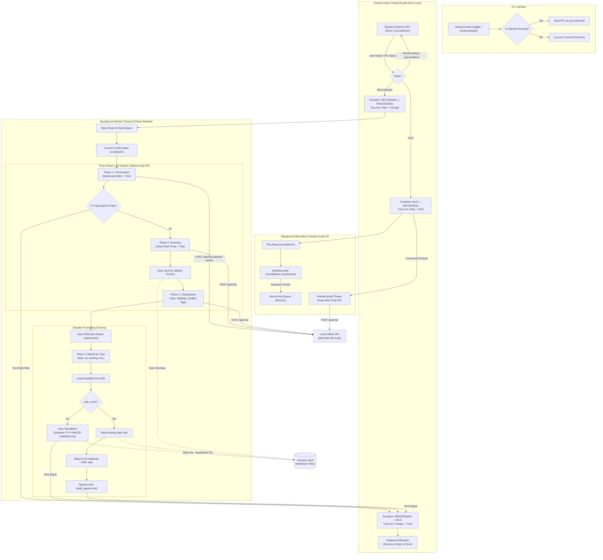

# System Architecture & Design

Eloquent Notes is engineered for Linux systems as a lightweight, background daemon that provides zero-latency voice dictation directly into Obsidian. It emphasizes low resource consumption, complete data privacy, and non-blocking desktop interaction.

---

## High-Level Component Architecture

The system consists of a decoupled daemon process and a fast client CLI interface communicating over local Unix domain sockets via PyQt6's IPC subsystem.

```
┌─────────────────────────────────────────────────────────────────┐
│                      CLI / Hotkey Trigger                       │
│                   `eloquent-notes toggle`                       │
└────────────────────────────────────────┬────────────────────────┘
                                         │ QLocalSocket (IPC)
                                         ▼
┌─────────────────────────────────────────────────────────────────┐
│              Daemon Process (PyQt6 Event Loop)                  │
│                                                                 │
│   ┌───────────────────────┐         ┌───────────────────────┐   │
│   │   QSystemTrayIcon     │         │    QLocalServer       │   │
│   │   (State & Menu)      │         │  (IPC Listener)       │   │
│   └───────────┬───────────┘         └───────────┬───────────┘   │
│               │                                 │               │
│               └────────────────┬────────────────┘               │
│                                │                                │
│                                ▼                                │
│                     EloquentApp Controller                      │
│            (State: IDLE → RECORDING → PROCESSING)               │
└───────────────┬─────────────────────────────────┬───────────────┘
                │                                 │
                ▼ (Background Thread)             ▼ (Background Thread)
┌───────────────────────────────┐ ┌───────────────────────────────┐
│    AudioRecorder & Preload    │ │      Three-Phase Pipeline     │
│  - sounddevice.InputStream    │ │  - Ollama REST API (Gemma 4)  │
│  - In-memory queue.Queue      │ │  - Wikilink & Callout format  │
│  - Preload keep-alive worker  │ │  - PyYAML Obsidian Writer     │
└───────────────────────────────┘ └───────────────────────────────┘
```

---

## 1. System Tray & Inter-Process Communication (IPC)

### PyQt6 Daemon & Event Loop
The background daemon runs continuously on top of the `QApplication` event loop (`app.setQuitOnLastWindowClosed(False)`). The user interface is anchored by `QSystemTrayIcon`, which displays dynamic status icons and provides a right-click context menu for starting/stopping dictation, opening the configuration dialog, reloading settings, or quitting the application.

### Decoupled Single-Instance IPC
When the user executes `eloquent-notes toggle` via a terminal or global desktop hotkey (such as GNOME, KDE, or i3/Sway shortcuts), the CLI entry point (`eloquent_notes.main`) executes a lightweight check:

1. It initializes `QCoreApplication` (loading only core low-level Qt primitives, without heavy GUI widgets).
2. It attempts to connect to a named Unix local socket (`eloquent_notes_ipc`) using `QLocalSocket`.
3. **If the daemon is already running:** The client writes `"toggle"` over the socket connection and exits immediately. The daemon's `QLocalServer` receives the `newConnection` signal, reads `"toggle"`, and invokes `toggle_action()`.
4. **If no daemon is running:** The CLI replaces its own process image using `os.execv` to spawn `eloquent_notes.app` in background daemon mode.

This architecture ensures zero start-up delay for hotkeys while maintaining a single daemon instance.

---

## 2. In-Memory Audio Capture & Zero Disk-IO

To maximize user privacy, eliminate security risks associated with unencrypted temporary audio files, and avoid unnecessary SSD wear, audio capture is performed entirely in RAM:

- **Stream Capture:** `sounddevice.InputStream` captures PCM audio samples directly from the system's default microphone using a lightweight callback that enqueues float32 numpy arrays into a Python `queue.Queue`.
- **In-Memory PCM Buffer:** When recording completes, `AudioRecorder.wav_bytes` drains the queue, concatenates all chunks into a unified NumPy array, scales the values to 16-bit signed PCM integer format (`clip(-32768, 32767).astype(np.int16)`), and writes the audio stream to an in-memory `io.BytesIO` buffer formatted as a standard WAV file.
- **Base64 Transmission:** The resulting raw WAV bytes are base64-encoded in memory and submitted directly in the JSON payload to Ollama's `/api/chat` endpoint. At no point is an audio file written to `/tmp` or disk.

### Audible Feedback Cues
To provide instant physical feedback when starting or stopping recording, Eloquent Notes synthesizes short sine-wave beep tones in real time using NumPy:
```python
t = np.linspace(0, duration, int(sample_rate * duration), False)
sine_wave = np.sin(frequency * t * 2 * np.pi)
```
To eliminate sharp acoustic pops or clicks when audio playback starts and stops on high-sensitivity headphones, a 10 millisecond linear fade-in and fade-out envelope is applied to the boundaries of the generated waveform array prior to sending it to `sounddevice.play()`.

---

## 3. Dynamic In-Memory Icon Generation

Instead of loading static PNG icons from disk, status indicators are rendered dynamically in RAM using Pillow (`PIL.ImageDraw`) and converted to Qt `QIcon` objects at runtime.

The tray icon changes colors and central glyphs based on internal app state:

| State | Circle Color | Center Icon Glyph | Internal Function |
| :--- | :--- | :--- | :--- |
| **IDLE** | Slate Gray (`#4B5563`) | White Microphone shape | App awaiting user trigger |
| **RECORDING** | Vivid Red (`#DC2626`) | White Recording Dot | Microphones streaming into RAM queue |
| **PROCESSING** | Amber Orange (`#D97706`) | White Hourglass polygon | LLM pipeline executing via background thread |

Rendering happens in `ui.create_icon_image(color)`:
1. A transparent 64×64 pixel `RGBA` canvas is created.
2. The outer colored circle backdrop is drawn (`ellipse`).
3. Vector-calculated inner shapes (rounded rectangle mic body, arcs, or polygons) are rasterized onto the canvas.
4. The image is exported into an in-memory `io.BytesIO` PNG stream and loaded into `QPixmap.loadFromData()` to return a `QIcon`.

---

## 4. Non-Blocking Multithreaded Execution

PyQt6 UI components run strictly on the main thread. To prevent UI freezing, cursor stuttering, or tray icon unresponsiveness during heavy audio encoding or LLM inference, long-running operations are offloaded to background threads (`threading.Thread`):

1. **Concurrent Model Preloading:** When recording begins (transitioning to `RECORDING`), a background thread is immediately spawned to issue an empty keep-alive chat request to Ollama. This forces the GPU to load model weights into VRAM while the user is actively speaking.
2. **Background Processing Thread:** When recording is toggled off (transitioning to `PROCESSING`), stopping the audio stream, compiling WAV bytes, executing the 3-phase LLM pipeline over HTTP, and writing notes to disk occur entirely inside `_process_audio()`, which runs on a dedicated daemon worker thread.
3. **Qt Signal Delivery:** When processing completes, the worker thread emits a custom PyQt thread-safe signal (`processing_completed.emit(status, path)`), transferring control back to the main GUI thread to display desktop notifications and reset the tray icon to gray IDLE mode.

---

## Complete Mermaid Execution Pipeline


