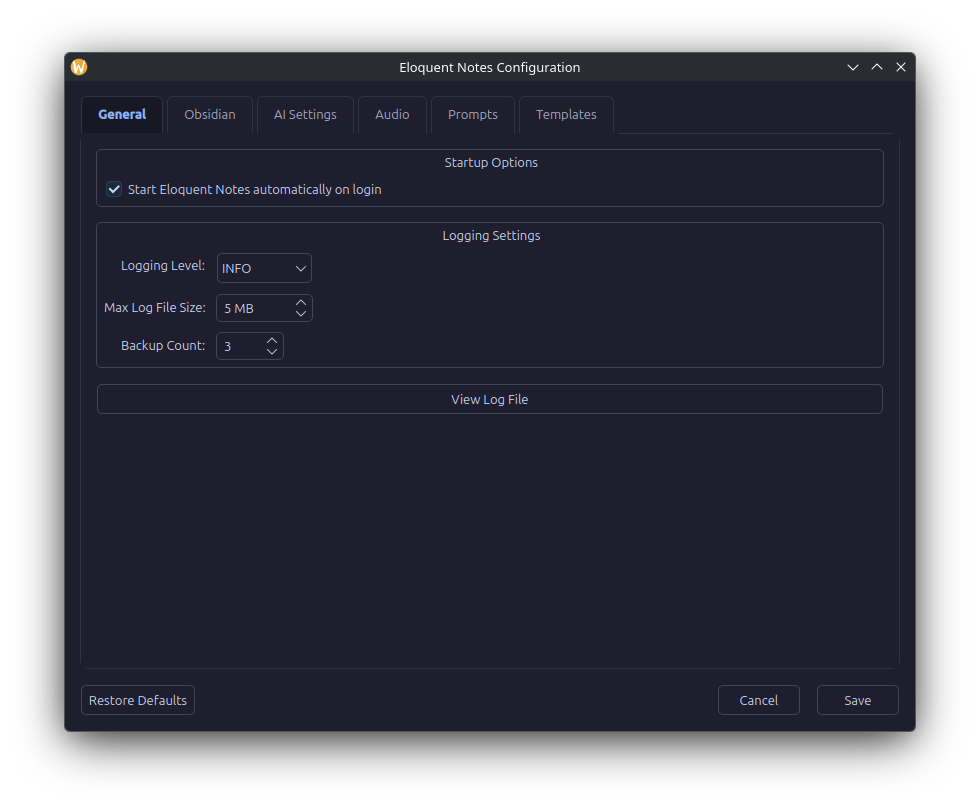

# Configuration & Templates

Eloquent Notes provides flexible configuration management, allowing users to customize behavior either visually through a built-in **PyQt6 Configuration GUI** or directly by editing YAML configuration and Markdown template files.

All configuration data, prompts, and templates are stored in standard user configuration paths under `~/.config/eloquent-notes/`.

---

## Built-in PyQt6 Configuration GUI

You can launch the configuration dialog at any time by running:

```bash
eloquent-notes config
```

Alternatively, right-click the Eloquent Notes system tray icon and select **Configuration**.



The dialog provides tabbed navigation across six settings panels, along with **Restore Defaults**, **Cancel**, and **Save** action buttons at the bottom.

### Tab Breakdown

#### 1. General
Configures runtime application logging behavior:
* **Log Level**: Verbosity level for system logs (`DEBUG`, `INFO`, `WARNING`, `ERROR`, `CRITICAL`).
* **Max File Size (MB)**: Maximum disk storage space dedicated to a single log file before rotation (default: `5` MB).
* **Backup Count**: Number of historical rotated log archives to preserve in storage (default: `3`).

#### 2. Obsidian
Controls how generated dictations are integrated into your Obsidian vault:
* **Vault Path**: The root path to your Obsidian vault directory (e.g., `~/Obsidian`).
* **Dictations Subfolder**: The subfolder relative to your vault root where standalone notes are stored (default: `Dictations`).
* **Subfolder Structure**: Organization strategy for notes inside the target folder (`none` for directly in target folder, `month` for `YYYY-MM`, `week` for `YYYY-Www`, or `month_week` for `YYYY-MM/Www`).
* **Enable Daily Notes**: When enabled, dictations classified as daily entries or quick thoughts are automatically routed to your Obsidian Daily Notes folder (`YYYY-MM-DD.md`).
* **Scan Vault Context**: Scans existing note titles in your vault and provides them as contextual hints to Gemma 4, allowing the model to automatically insert `[[WikiLinks]]` when existing topics are mentioned in audio.

#### 3. AI Settings
Configures connection parameters and behavior for the local Ollama inference server:
* **Ollama Server URL**: Endpoint URL of your running Ollama service (default: `http://localhost:11434`).
* **Model Name**: Large language / multimodal model tag (default: `gemma4:e4b-it-qat`).
* **Context Length (`num_ctx`)**: Context window limit for LLM requests (default: `8192` tokens).
* **Keep-Alive Duration**: Time duration to keep model weights loaded in VRAM after note generation (e.g., `0` for immediate unload, `5m`, `10m`).
* **Preload Keep-Alive**: VRAM persistence duration while actively recording audio to minimize latency during generation (default: `5m`).
* **Max Retries**: Retry count for JSON schema validation failures during prompt execution (default: `3`).
* **Preload Timeout**: Maximum wait time in seconds for model weights to load into memory (default: `180` seconds).
* **Request Timeout**: Maximum wait time in seconds for inference generation to complete (default: `300` seconds).

#### 4. Audio
Controls input recording settings, duration limits, and visual/audible status notifications:
* **Sample Rate**: Recording sample frequency in Hertz (default: `16000` Hz / 16 kHz).
* **Channels**: Audio channels captured (`1` for Mono, `2` for Stereo).
* **Capture Duration**: Maximum recording duration in seconds before automatically stopping and sending to LLM (default: `30` seconds).
* **Show Recording HUD**: Displays a floating pill overlay with real-time countdown timer and progress bar while dictating (default: `true`).
* **Enable Audio Feedback**: Toggle sound effects played upon starting and stopping recording.
* **Beep Frequency**: Pitch of the audio tone in Hertz (default: `440` Hz, musical note A4).
* **Beep Duration**: Length of tone playback in seconds (default: `0.1` seconds).

#### 5. Prompts
Provides a rich text editor for customizing the Markdown prompts that drive each stage of the three-phase AI pipeline:
* **Transcription System & User Prompts**: Direct audio-to-text conversion and noise filtering.
* **Rewriting System & User Prompts**: Structuring raw text into coherent titles and formatted Markdown content.
* **Classification System & User Prompts**: Metadata extraction (note category, tags, and wikilinks).
* **Retry Prompt**: Correction instructions issued when LLM output violates expected JSON formatting.

#### 6. Templates
Allows live editing of the Markdown layout templates used when creating notes in your Obsidian vault.

---

## Manual YAML Configuration Reference (`config.yaml`)

When initialized, Eloquent Notes creates `~/.config/eloquent-notes/config.yaml`. Below is the complete reference schema with default values:

```yaml
obsidian:
  vault_path: "~/Obsidian"
  folder: "Dictations"
  folder_organization: "none"   # Subfolder structure: "none", "month" (YYYY-MM), "week" (YYYY-Www), "month_week" (YYYY-MM/Www)
  daily_notes: true
  vault_context: true   # Scan vault for existing note names to suggest as wikilinks


ai:
  ollama_url: "http://localhost:11434"
  model: "gemma4:e4b-it-qat"
  context_length: 8192  # Context window size in tokens
  keep_alive: "0"       # VRAM retention after note completion ("0" unloads immediately)
  preload_keep_alive: "5m" # VRAM retention during active recording
  max_retries: 3        # Retries on JSON parsing failure
  preload_timeout: 180  # Seconds allowed for model load
  request_timeout: 300  # Seconds allowed for request inference

audio:
  sample_rate: 16000
  channels: 1
  capture_duration: 30  # Maximum audio capture duration in seconds
  recording_hud_enabled: true # Floating countdown HUD overlay during recording
  beep_frequency: 440
  beep_duration: 0.1
  beep_enabled: true

logging:
  level: "INFO"
  max_mb: 5
  backup_count: 3
```

---

## Custom Markdown Prompts

System and user prompts reside in `~/.config/eloquent-notes/prompts/`:

| File Name | Purpose | Key Variables / Notes |
| :--- | :--- | :--- |
| `transcription_system.md` | System instructions for audio transcription phase. | Sets multi-modal audio processing behavior. |
| `transcription_user.md` | User prompt accompanying audio input. | Instructs model to extract speech verbatim. |
| `rewriting_system.md` | System instructions for note rewriting phase. | Defines tone, formatting, and heading structure. |
| `rewriting_user.md` | User prompt for note rewriting phase. | Accepts `{transcription}` variable. |
| `classification_system.md` | System instructions for note classification phase. | Rules for metadata extraction and JSON output. |
| `classification_user.md` | User prompt for classification phase. | Accepts `{transcription}` and `{vault_context}` variables. |
| `retry_prompt.md` | Correction prompt on invalid JSON responses. | Forces model to output strict JSON schema. |

---

## Custom Markdown Templates

Note formatting templates reside in `~/.config/eloquent-notes/templates/`:

### 1. `standalone.md`
Used when creating individual standalone notes inside your configured `folder`:

```markdown
---
date: {date}
time: {time}
tags:
{tags}
---

# {title}

{text}
```

### 2. `daily_new.md`
Used when creating a new Daily Note for the current day:

```markdown
---
date: {date}
tags:
  - daily-notes
---

# Daily Note - {date}

## Dictations

### {time} - {title}
{text}
```

### 3. `daily_append.md`
Appended to an existing Daily Note when additional dictations are recorded on the same day:

```markdown
### {time} - {title}
{text}
```

### Available Template Placeholders

| Placeholder | Description | Example Output |
| :--- | :--- | :--- |
| `{title}` | Title generated by Phase 2 (Rewriting) | `Project Architecture Review` |
| `{text}` | Clean, structured Markdown content body | Main note paragraphs and bullet lists |
| `{tags}` | Indented YAML tag array generated by Phase 3 | `  - architecture`<br>`  - meeting` |
| `{date}` | Current local date | `2026-08-06` |
| `{time}` | Current local time stamp | `14:30:15` |
